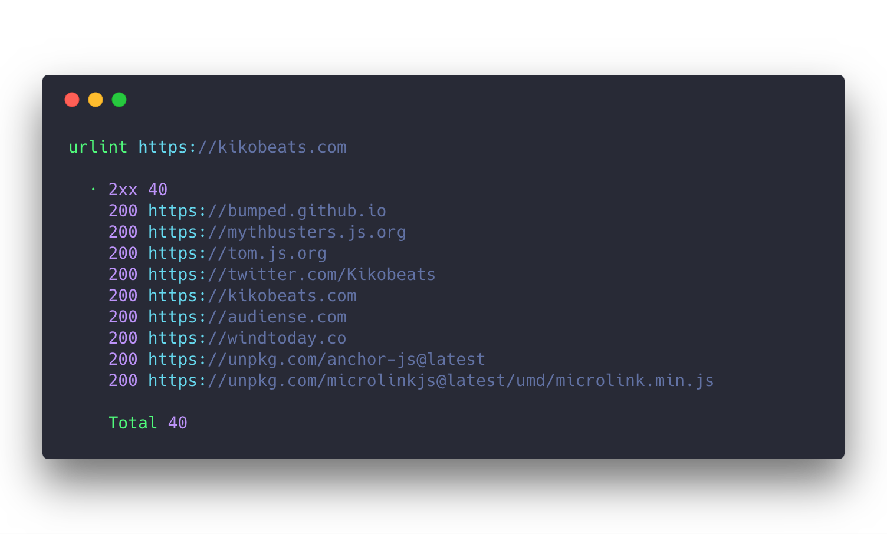

# urlint-cli

<h1 align="center">
  

</h1>


[](https://travis-ci.org/urlint/urlint-cli)
[](https://david-dm.org/urlint/urlint-cli)
[](https://david-dm.org/urlint/urlint-cli#info=devDependencies)
[](https://www.npmjs.org/package/urlint-cli)
[](https://paypal.me/Kikobeats)

> Check the availability of links on your website.

## Install

```bash
$ npm install urlint-cli --global
```

## License

**urlint-cli** © [Kiko Beats](https://kikobeats.com), released under the [MIT](https://github.com/urlint/urlint-cli/blob/master/LICENSE) License.<br>
Authored and maintained by Kiko Beats with help from [contributors](https://github.com/urlint/urlint-cli/contributors).

> [kikobeats.com](https://kikobeats.com) · GitHub [@Kiko Beats](https://github.com/Kikobeats) · Twitter [@Kikobeats](https://twitter.com/Kikobeats)
